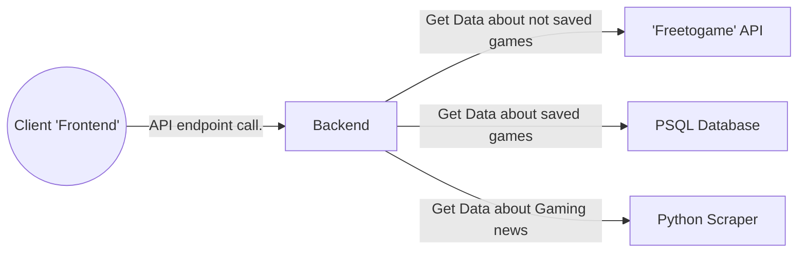

# FAM-scraper

This is the scraper of my interesting PET project.  
For the other parts, please use the following links:
- [Frontend](https://github.com/csipkek98/FAM-frontend)
- [Backend](https://github.com/csipkek98/FAM-backend)

## About the project
The project is meant to be a "home page" for my friend group. It contains a News page, where we can find news related to gaming and a "Free game" page, where I use an API to get data from games that are free to play.

## Project structure

Presentation flowchart with a simple request on the backend

## About Scraper

The scraper is built using Python and utilizes a Flask server to enable communication with the backend server. It uses the 'BeautifulSoup4' module to extract the relevant data from the news sites. By navigating to the target URL, the scraper identifies and retrieves the specified HTML tags that have been designated for scraping. Subsequently, we save the relevant information, such as the title and time stamp, to a dictionary. Once we have stored all the desired data, we proceed to store this dictionary as a value within another dictionary, using the news site name as the key.

## Automated scraping process

To avoid generating excessive and unnecessary requests to the news sites, I limit the frequency of scraping to every 15 minutes using the module "BackgroundScheduler". When the backend server wants the news data, I simple give it back my (in memory) stored news dictionary parsed into JSON.

As in the example, we provide the function that needs to be executed periodically, then we set the trigger to 'interval' and specify the frequency in minutes, which in this case is set to 15 minutes.

## Endpoints

There is only two different endpoints currently for two different news sites, but I can expand this number in the future easily if I want to

As I said before, we get the corresponding news site dictionary data and parse it into JSON

## Afterthought

At present, this part of the project is contained within a single .py file. However, in the future I want to separate the page-specific scraping functions into different files in the future, and to transform the current .py file into a file that consolidates these separate files.
